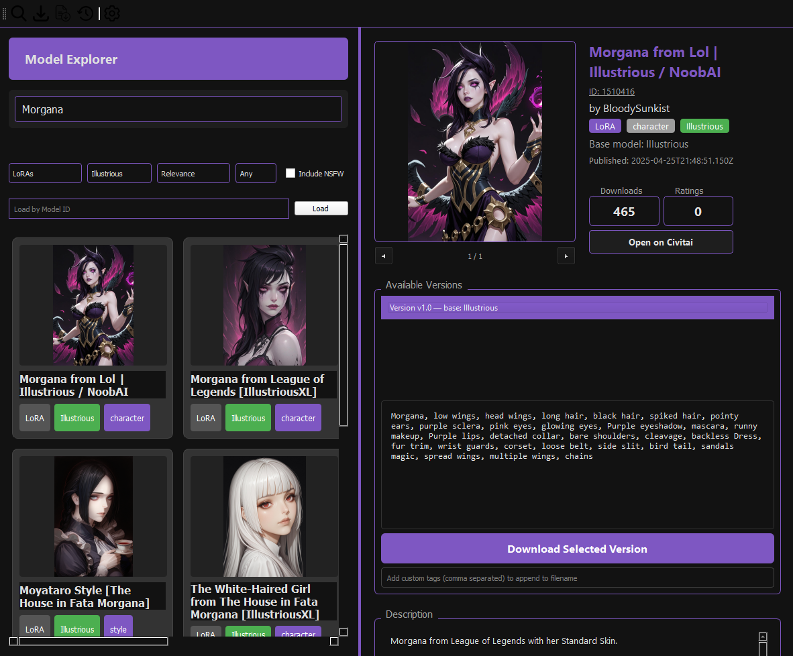

  </img>

# CivitAI Download Manager v0.4.0-beta
Desktop application for brownsing, downloading and managing Checkpoints, LoRA's and Embedding models from <a href=civitai.com> CivitAI </a> using public REST-API.  
[CivitAI API Documentation](https://developer.civitai.com/docs/intro)

## Features

### Search Explorer
- Model browser from CivitAI
- Search results filters: Type of model, Base model, type of sort, Time period and NSFW content
- Search by Model ID

### Download Manager
- Sends model downloads to queue.
- Keeps tracking of download progress.
- Downloads low-res images for model previews locally.
- Adds tags depeding of type of model

### Downloaded Model Explorer
- Saves metadata into Sqlite3 database.
- Allows to view downloaded Models.
- Downloaded Models includes preview images.

### Detail Panel
- Include 5 showcase images by model version. (Available offline)
- Preview Model ID, Creator, Model type tag, Category tag, Basemodel tag.  (Available offline)
- Button to open model details on CivitAI website. (Available offline)
- Preview trigger words (Available offline)
- Preview available versions. (Available offline)
- Model's Description. (Available offline)
- Input text to add custom tag to filename
- Manages downloaded models

### Download History
- Keeps tracking of every download made. (Saved on local database)
- Saves Title, Model ID, Model version, Date Downloaded, Model size, file status.
- Saves deleted and failed downloads logs.
- Export/Import history data.
- Import history data partly loads downloaded model's metadata such as: Trigger words, Model Version, Model's CivitAI website, description

### Limitations
- Windows-only (tested on Windows 10/11)
- Requires internet connection for API access
- Large model collections may require significant storage

### Practices
- API keys stored securely in Windows Registry (not in files)
- File integrity verification with SHA-256 hashing
- Safe download handling (prefers .safetensors over .pkl)
- Export files exclude sensitive data

### How to use?

1. **Download** the release package below or **clone repository**
2. **Extract** to your preferred location
3. **Double-click** `run.bat` to launch
4. **Add your CivitAI API key** in Settings
